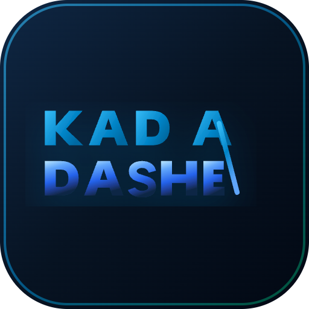

  

<h1 align="center">Kadashe — Traditional Adashe. Programmatic Trust.</h1>

  <strong>Offline-first PWA digitalizing Nigerian rotating savings (Adashe / Ajo / Esusu)</strong> 
  with real-time transparent ledgers, Paystack zero-custody escrow, and algorithmic AI reputation scoring.

  
  
  
  
  
  

---

## 🇳🇬 1. Executive Summary & Problem Solved

Over **40 million Nigerians** participate in informal rotating savings associations (**Adashe / Ajo / Esusu**) — pooling money weekly or monthly so each member receives a lump-sum payout in turn. Traditional Adashe moves over **₦1.8 Trillion annually** but is plagued by:

1. **Embezzlement & Default Risk:** Fraudulent collectors (*Alajo*) running away with communal savings.
2. **Paper Notebook Disputes:** Lack of transparent payment accounting and immutable audit trails.
3. **Cash-Handling Vulnerability:** Physical cash transit dangers and armed robbery risks in local markets.
4. **Organizer Monopolies:** Circle creators unfairly taking first-payout slots to cash out early.

**Kadashe** solves this through **Zero-Custody Paystack Escrow**, **The Organizer Payout Immunity Law**, an **Algorithmic AI Reputation Engine**, and a **Live Real-Time Glass Ledger**.

---

## 🎓 2. 3MTT Capstone Supervisor & Evaluator Fast-Pass

> 📘 **Full Evaluator Document:** See [`SUPERVISOR_EVALUATION_GUIDE.md`](./SUPERVISOR_EVALUATION_GUIDE.md) for 5 interactive testing journeys, live savings circles, and security disclosures.

For rapid assessment without email OTP delays, the system includes pre-seeded Nigerian test accounts:

| Role / Persona | Email | Password | Turn / Status | AI Trust | Access & Capabilities |
|---|---|---|:---:|:---:|---|
| **🛡️ Helper Admin 1** | `moderator1@kadashe.ng` | `KadasheAdmin2026!` | N/A | 100/100 | Full Admin Console (`/admin`), Circle Freeze, Fraud Suspension |
| **🛡️ Helper Admin 2** | `moderator2@kadashe.ng` | `KadasheAdmin2026!` | N/A | 100/100 | Operations Moderation, User KYC & Trust Dossier Inspector |
| **👤 Babajide Adeleke** | `babajide@kadashe.ng` | `KadasheTest2026!` | **Turn #1** | 65 / 100 | Paid ✅ (Scheduled to receive ₦125,000 Round #1 Payout) |
| **👤 Amina Onize Bello** | `amina@kadashe.ng` | `KadasheTest2026!` | **Turn #2** | 65 / 100 | Paid ✅ (Circle Organizer yielding priority) |
| **👤 Musa Danladi** | `musa@kadashe.ng` | `KadasheTest2026!` | **Turn #3** | 65 / 100 | Paid ✅ (Tier 2 Verified Contributor) |
| **👤 Emeka Okafor** | `emeka@kadashe.ng` | `KadasheTest2026!` | **Turn #4** | 65 / 100 | Paid ✅ (Tier 2 Verified Contributor) |
| **👤 Chinedu Eze** | `chinedu@kadashe.ng` | `KadasheTest2026!` | **Turn #5** | 60 / 100 | **Due R1 ⏳ (Unpaid — Ready for Supervisor Live Paystack Test)** |

> ⚖️ **Segregation of Duties Notice:** In adherence to CBN & ISO 27001 fintech standards, the master **Super Admin** account (`nuhulawal20@gmail.com`) is air-gapped from evaluator demo access to preserve infrastructure segregation of duties and eliminate moral hazard.

---

## 🪪 3. 3-Tier KYC Verification & Pool Capacity Architecture

Kadashe enforces strict identity gating because in communal savings, **no pooled capital is too small to protect**:

| KYC Tier | Verification Requirements | Max Total Pool Payout | Privileges & Unlocks |
|---|---|:---:|---|
| **Tier 0 (Unverified)** | Account Email & Password | **₦0.00** | View & explore only (Cannot create or join circles) |
| **Tier 1 (BVN / NIN)** | 11-Digit BVN (NIBSS) or NIN (NIMC) | **₦1,000,000** | Create & join pools up to ₦1M (`+15 pts` Trust Boost) |
| **Tier 2 (Gov ID & Biometrics)** | Government ID + 3D Facial Liveness | **₦10,000,000** | Create & join pools up to ₦10M (`+30 pts` Trust Boost) |
| **Tier 3 (CAC Registration)** | Corporate Affairs Commission Document | **UNLIMITED** | Unlimited high-yield merchant and cooperative pools (`+40 pts`) |

---

## 🧠 4. Algorithmic AI Reputation Engine & Core Laws

$$\text{Trust Score} = \text{Base (30)} + \text{KYC Boost (up to +40)} + \text{Payments (up to +20)} + \text{Cycles (up to +10)} - \text{Defaults (-25/each)}$$

1. **The Organizer Payout Immunity Law (Hard Constraint):**
   * Under NO circumstances can the Circle Organizer / Creator take **Turn #1 (Position #1)**.
   * Turn #1 is strictly reserved for a regular non-organizer peer member to prevent fraudulent pool creation for instant capital extraction.
2. **Dynamic PostgreSQL Calculation (`calculate_trust_score` RPC):**
   * Factored automatically on every KYC verification and verified Paystack payment event.
3. **Transparent Glass Ledger:**
   * Every payment debit, escrow lock, and rotational payout generates a cryptographic receipt that broadcasts live in real-time.

---

## 💳 5. Dual-Pillar Financial Engine (Wallet & Escrow)

* **Ready Personal Wallet (`/wallet`):** Ready-to-spend balance for instant 0-fee circle contributions and immediate payouts.
* **Zero-Custody Escrow (`/circles/[id]`):** Automated locked funds powered by Paystack.
* **AML Bank Account Name-Matching Security:**
  * Uses Paystack's real-time Name Enquiry API to perform tokenized string-similarity matching between the recipient bank account name and the user's verified KYC name.
  * **Strictly blocks third-party bank accounts** to prevent financial fraud and money laundering.

---

## 🛠 6. Tech Stack & Infrastructure

| Layer | Technology |
|---|---|
| **Framework** | Next.js 16 (App Router, Turbopack, React 19) |
| **Language** | TypeScript (Strict Mode) |
| **Styling** | Tailwind CSS v4 + shadcn/ui (Base UI) |
| **Database & Auth** | Supabase PostgreSQL + Row Level Security (RLS) |
| **Realtime** | Supabase Realtime WebSocket Subscriptions |
| **Payment Gateway** | Paystack Inline Gateway + HMAC-SHA512 Webhooks |
| **Rate Limiting** | Upstash Redis Sliding Window |
| **Media CDN** | Cloudinary (Zero Supabase bandwidth stress) |
| **PWA & Offline** | @ducanh2912/next-pwa + Dexie.js (IndexedDB) |
| **Error Tracking** | Sentry SDK (with PII scrubbing) |
| **Analytics** | Vercel Analytics + Speed Insights |
| **Hosting** | Vercel Production Infrastructure |

---

## 🔐 7. Security Architecture (10 Layers)

1. **PostgreSQL RLS** — Strict Row Level Security policies on all 4 core tables.
2. **PKCE Authentication** — Supabase Auth with Proof Key for Code Exchange.
3. **Rate Limiting** — Upstash Redis sliding window (5 requests / 15 min on auth).
4. **HMAC-SHA512** — Cryptographic signature verification on Paystack webhooks.
5. **Zod Validation** — Type-safe schema validation on every inbound API request.
6. **Service Role Isolation** — Admin client strictly isolated from browser exposure.
7. **UNIQUE Constraint Protection** — `paystack_reference` guarantees zero double-crediting.
8. **AML Name-Matching** — Enforces verified name matching on all bank withdrawals.
9. **Media Offloading** — Cloudinary CDN shields database from binary file strain.
10. **Sentry PII Scrubbing** — Sensitive emails and credentials scrubbed before telemetry.

---

## 📱 8. PWA Installation & Anti-Impersonation

* **Add to Home Screen:** Installable on iOS Safari and Android Chrome with branded **KAD A DASHE** icon and launch splash screen.
* **Anti-Impersonation Protection:** Members are advised and guided to join circles exclusively using the **6-character alphanumeric Invite Code** (`KADASHE-XXXXXX`) or direct invite link, preventing accidental entry into look-alike pools.

---

## 👨‍💻 9. Fellow Information

| Field | Value |
|---|---|
| **Fellow Name** | Nuhu Lawal |
| **Fellow ID** | FE/23/84783109 |
| **Email** | nuhulawal20@gmail.com |
| **Track** | Software Development — 3MTT NextGen Capstone |
| **ALC Center** | Almara Hub - Paragon Nigeria, Kaduna State |

---

## 📄 License

MIT License — Open source for the Nigerian fintech and developer community.
